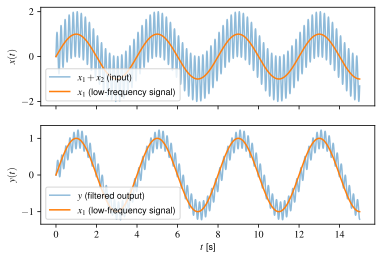

# How to Implement a First-Order Low-Pass Filter in Discrete Time

We often teach or learn about filters in continuous time, but then need to implement them in discrete time (e.g., in code) on data acquired at discrete sample times.  This notebook shows one way to design and implement a simple first-order low-pass filter in discrete time.  The example is written in Python and uses [Matplotlib](https://matplotlib.org).

## Main File(s)

* [first-order-lpf.ipynb](https://nbviewer.jupyter.org/github/botprof/first-order-low-pass-filter/blob/main/first-order-lpf.ipynb) (Jupyter notebook)

## Sample Output

Here is an sample of the output.



## References

This is relatively standard material.  Supplementary web links are given in the Jupyter notebook.

## Cite this Work

You may wish to cite this work in your publications.

> Joshua A. Marshall, How to Implement a First-Order Low-Pass Filter in Discrete Time, 2021, URL: [https://github.com/bot-doc/first-order-low-pass-filter](https://github.com/botprof/first-order-low-pass-filter).

You might also use the BibTeX entry below.

```latex
@misc{Marshall2021,
  author = {Marshall, Joshua A.},
  title = {How to Implement a First-Order Low-Pass Filter in Discrete Time},
  year = {2021},
  howpublished = {\url{https://github.com/botprof/first-order-low-pass-filter}}
}
```

## License

Source code examples in this notebook are subject to an [MIT License](LICENSE).
